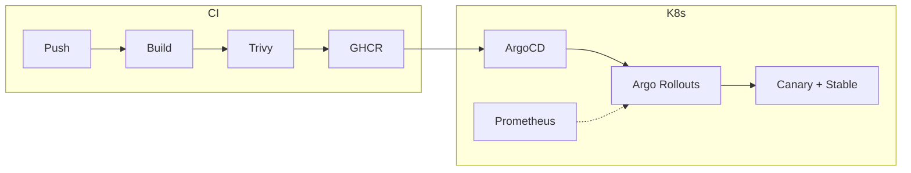
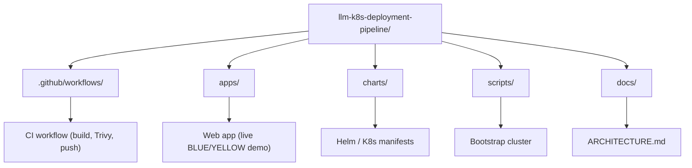

# LLM K8s Deployment Pipeline

Local, production-simulated Kubernetes stack: **CI** (GitHub Actions + Trivy → GHCR) and **progressive delivery** (ArgoCD + Argo Rollouts canary) for a simple web app. The app shows **live request data**: requests hit the backend; responses from **stable (BLUE)** or **canary (YELLOW)** are shown with visual cues in the UI. Canary promote/rollback is driven by Prometheus metrics.

---

## What You Get



- **One push** → image build, Trivy scan, push to GHCR → ArgoCD sync → canary rollout.
- **Metrics-based** automatic promote (or rollback) via Argo Rollouts + Prometheus.
- **Multi-node kind** cluster; optional Grafana dashboard for canary vs stable.

Full design: **[Architecture](docs/ARCHITECTURE.md)**.

---

## Repo Layout



| Path | Purpose |
|------|--------|
| `.github/workflows/` | GitHub Actions: build, Trivy, push to GHCR |
| `apps/` | Web app: frontend + backend (BLUE stable / YELLOW canary), live request visuals and Prometheus metrics |
| `charts/` | Helm chart(s) and Argo Rollouts manifests |
| `scripts/` | Cluster bootstrap (kind create, optional tooling) |
| `docs/` | Architecture and design (e.g. [ARCHITECTURE.md](docs/ARCHITECTURE.md)) |

---

## Prerequisites

- **Docker** (kind runs nodes as containers)
- **kind** – [install](https://kind.sigs.k8s.io/docs/user/quick-start/#installation)
- **kubectl** – [install](https://kubernetes.io/docs/tasks/tools/)

---

## Quick Start (Phase 1: Cluster)

1. **Create the multi-node kind cluster**

   ```bash
   ./scripts/bootstrap.sh
   ```

   Or with explicit config:

   ```bash
   kind create cluster --config kind-config.yaml --name llm-k8s
   ```

2. **Verify**

   ```bash
   kubectl cluster-info --context kind-llm-k8s
   kubectl get nodes
   ```

3. **Run the web app (Phase 1)** — BLUE/YELLOW bubble demo:

   ```bash
   cd apps && npm install && npm start
   ```

   Open http://localhost:5000 (use `PORT=5001 npm start` if 5000 is in use). You should see the flowing bubble stream and summary bar updating at 10 req/s.

Phase 2 will add ArgoCD, the app, and the canary rollout; the README will be updated with full runbook (push → observe canary in Argo Rollouts / Grafana).

---

## Skills Demonstrated (Mapping to Role)

| Area | Where in This Repo |
|------|--------------------|
| **Kubernetes (production-like)** | Multi-node kind cluster, workloads and rollouts |
| **Docker / containers** | App image build in CI, image lifecycle (build → scan → push) |
| **Helm** | Charts in `charts/` for app and rollout |
| **CI/CD** | GitHub Actions: build → Trivy → GHCR |
| **Deployment strategies** | Argo Rollouts canary; promote/rollback on metrics |
| **Observability** | Prometheus + (optional) Grafana; metrics drive canary analysis |
| **Production app on K8s** | Web app (BLUE/YELLOW) deployed and versioned; live canary visibility in UI |

---

## Docs

- **[Architecture](docs/ARCHITECTURE.md)** – High-level design, data flow, traffic routing, canary strategy, and Prometheus metrics (Mermaid diagrams).
- **[Requirements](requirements.md)** – Overview, phases, and acceptance criteria.
