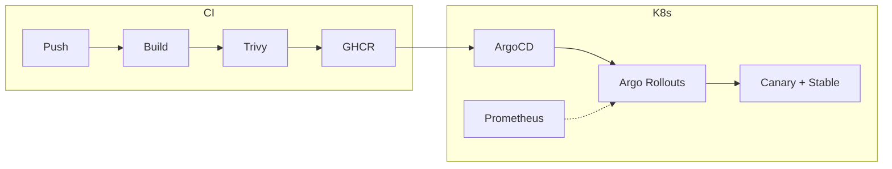
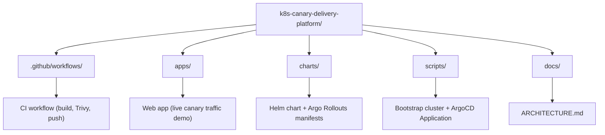

# K8s Canary Delivery Platform

Local, production-simulated Kubernetes stack: **CI** (GitHub Actions + Trivy → GHCR) and **progressive delivery** (ArgoCD + Argo Rollouts canary) for a simple web app. The app shows **live request data**: requests hit the backend; responses from **stable** or **canary** pods are shown with visual cues in the UI — each version gets its own color, discovered automatically. Canary promote/rollback is driven by Prometheus metrics.

---

## What You Get



- **One push** → image build, Trivy scan, push to GHCR → ArgoCD sync → canary rollout.
- **Metrics-based** automatic promote (or rollback) via Argo Rollouts + Prometheus.
- **Multi-node kind** cluster with Nginx Ingress for traffic routing.

Full design: **[Architecture](docs/ARCHITECTURE.md)**.

---

## Repo Layout



| Path | Purpose |
|------|--------|
| `.github/workflows/ci.yml` | GitHub Actions: build image, Trivy scan, push to GHCR, update image tag in Helm values |
| `apps/` | Web app: Express backend (VERSION + ROLE env vars + Prometheus `/metrics`) and static frontend (bubble stream UI) |
| `charts/canary-demo/` | Helm chart: Argo Rollout, stable + canary Services, Nginx Ingress, AnalysisTemplate |
| `scripts/` | `bootstrap.sh` (kind + platform install), `argocd-application.yaml` (GitOps app CR) |
| `docs/` | [ARCHITECTURE.md](docs/ARCHITECTURE.md) — design, data flow, canary strategy |

---

## Prerequisites

- **Docker** (kind runs nodes as containers)
- **kind** – [install](https://kind.sigs.k8s.io/docs/user/quick-start/#installation)
- **kubectl** – [install](https://kubernetes.io/docs/tasks/tools/)
- **Helm** – [install](https://helm.sh/docs/intro/install/)

---

## Quick Start

### 1. Bootstrap the cluster

Creates the kind cluster and installs Nginx Ingress, ArgoCD, Argo Rollouts, and Prometheus:

```bash
./scripts/bootstrap.sh
```

### 2. Deploy the ArgoCD Application

```bash
kubectl apply -f scripts/argocd-application.yaml --context kind-canary-demo
```

ArgoCD will sync the Helm chart and create the Rollout, Services, Ingress, and AnalysisTemplate.

### 3. Access the UIs

**ArgoCD:**
```bash
# Get the admin password
kubectl -n argocd get secret argocd-initial-admin-secret \
  -o jsonpath='{.data.password}' --context kind-canary-demo | base64 -d

# Port-forward the UI
kubectl port-forward svc/argocd-server -n argocd 8080:443 --context kind-canary-demo
```
Open https://localhost:8080 (user: `admin`).

**Argo Rollouts dashboard:**
```bash
kubectl argo rollouts dashboard --context kind-canary-demo
```
Open http://localhost:3100.

**Prometheus:**
```bash
kubectl port-forward svc/prometheus-server -n monitoring 9090:80 --context kind-canary-demo
```
Open http://localhost:9090.

**App (via Ingress):**
```bash
# Add to /etc/hosts: 127.0.0.1 canary-demo.local
curl http://canary-demo.local/api/request
```
Or port-forward the stable service:
```bash
kubectl port-forward svc/canary-demo-stable 5000:80 --context kind-canary-demo
```
Open http://localhost:5000 to see the live bubble stream UI.

### 4. Trigger a canary rollout

Tag a new version to trigger the CI pipeline:

```bash
git tag v2
git push origin v2
```

This triggers GitHub Actions to build, scan, and push the new image, then update the image tag in `charts/canary-demo/values.yaml`. ArgoCD detects the change and Argo Rollouts begins the canary:

1. **20% traffic** → canary pods (new version) for 60s
2. **Analysis** → Prometheus checks success rate (must be >= 95%)
3. **50% traffic** → canary for 60s
4. **Analysis** → second check
5. **100%** → full promotion

Watch it live:
```bash
kubectl argo rollouts get rollout canary-demo --watch --context kind-canary-demo
```

The app UI will show a mix of colored bubbles during the rollout (one color per version), reflecting the real traffic split.

### 5. Test rollback (optional)

To simulate a failed canary, deploy a version that returns errors — the AnalysisTemplate will detect the drop in success rate and Argo Rollouts will automatically roll back.

---

## Local Development (no cluster needed)

```bash
cd apps && npm install && npm start
```

Open http://localhost:5000. The app defaults to `VERSION=v2 ROLE=canary`. Override with:

```bash
VERSION=v1 ROLE=stable npm start
```

Run two instances on different ports to simulate a live canary split:

```bash
VERSION=v1 ROLE=stable  PORT=5001 npm start &
VERSION=v2 ROLE=canary  PORT=5002 npm start &
```

---

## Skills Demonstrated

| Area | Where in This Repo |
|------|--------------------|
| **Kubernetes (production-like)** | Multi-node kind cluster, workloads, Ingress, Services |
| **Docker / containers** | Dockerfile, image lifecycle (build → scan → push) |
| **Helm** | `charts/canary-demo/` — Rollout, Services, Ingress, AnalysisTemplate |
| **CI/CD** | `.github/workflows/ci.yml` — build, Trivy, GHCR, GitOps image tag update |
| **Progressive delivery** | Argo Rollouts canary (20% → 50% → 100%) with Nginx traffic routing |
| **GitOps** | ArgoCD syncs from repo; CI commits image tag updates |
| **Observability** | Prometheus scrapes app `/metrics`; AnalysisTemplate drives promote/rollback |
| **Traffic management** | Nginx Ingress Controller with weight-based canary splitting |

---

## Docs

- **[Architecture](docs/ARCHITECTURE.md)** – High-level design, data flow, traffic routing, canary strategy, and Prometheus metrics.
- **[Requirements](requirements.md)** – Overview, phases, and acceptance criteria.
