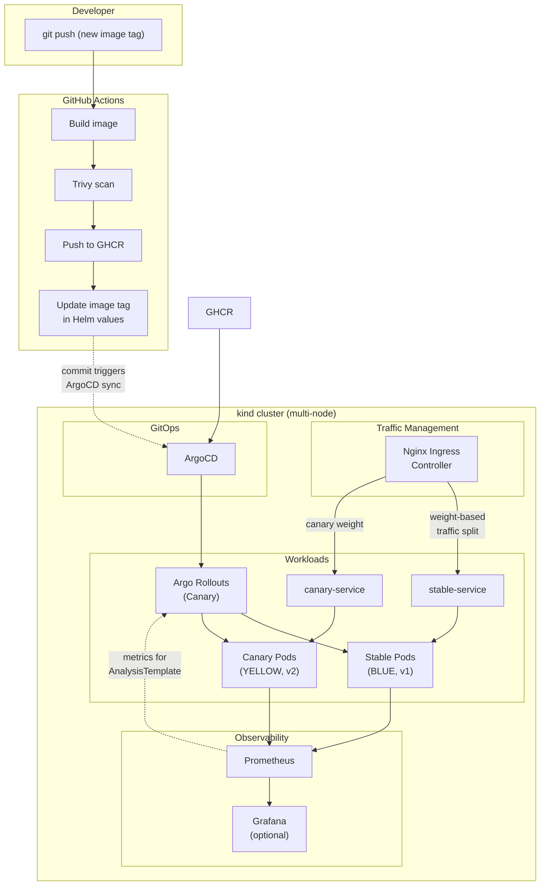
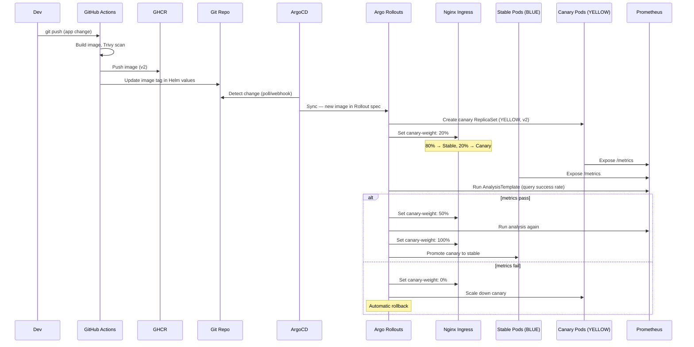

# Architecture: LLM K8s Deployment Pipeline

This document describes the high-level architecture of the local, production-simulated Kubernetes platform used for CI and canary (progressive) delivery of a simple web application. The app shows **live request data**: the UI sends requests to the backend; responses indicate whether they were served by **stable (BLUE)** or **canary (YELLOW)**; the frontend displays this with visual cues (blue vs yellow).

## Purpose

- Demonstrate a full **Continuous Integration** path: build → vulnerability scan → push to registry.
- Demonstrate **Progressive Delivery**: canary rollout with **metrics-driven** automatic promotion or rollback.
- Provide a **visual, runnable** proof of skills for Kubernetes, GitOps, and observability (e.g. for Senior DevOps interviews).

## High-Level Design



## Components

| Component | Role |
|-----------|------|
| **GitHub Actions** | Build container image, run Trivy scan, push image to GHCR, update image tag in Helm values (commit back to repo). |
| **GHCR** | Container image registry. |
| **kind** | Local multi-node Kubernetes cluster (1 control-plane + 1 worker). |
| **Nginx Ingress Controller** | Traffic manager for Argo Rollouts. Routes requests to stable and canary Services based on configured weights (e.g. 80/20). Lightweight and well-supported on kind. |
| **ArgoCD** | GitOps: watches this repo for changes to manifests/Helm values; syncs application state to the cluster when the image tag is updated by CI. |
| **Argo Rollouts** | Canary rollout controller: manages canary/stable ReplicaSets, configures Nginx Ingress annotations for traffic weight, runs AnalysisTemplates against Prometheus to decide promote vs rollback. |
| **Web App** | Backend: Express HTTP service that returns its variant (BLUE or YELLOW) based on `VARIANT` env var, exposes Prometheus metrics via `/metrics`. Frontend: static UI that sends requests and shows live data with blue/yellow visual cues. Both served from the same container. |
| **Prometheus** | Scrapes app metrics (`/metrics` endpoint); queried by Argo Rollouts AnalysisTemplate to decide promote vs rollback. |
| **Grafana** (optional) | One dashboard with 1–2 charts (e.g. canary vs stable request rate, success rate) for visual validation. |

## How ArgoCD Detects New Images

The pipeline follows a standard **GitOps image update** flow:

1. CI builds and pushes a new image to GHCR (e.g. `ghcr.io/<owner>/canary-demo:v2`).
2. CI updates the image tag in the Helm chart values file (e.g. `charts/canary-demo/values.yaml`) and commits the change back to the repo.
3. ArgoCD detects the git change (via polling or webhook) and syncs the updated manifests to the cluster.
4. Argo Rollouts sees the new image in the Rollout spec and begins the canary rollout.

This keeps the repo as the single source of truth — no out-of-band image updates.

## Traffic Routing: Nginx Ingress

Argo Rollouts integrates with Nginx Ingress Controller for precise weight-based traffic splitting:

- The Rollout resource references a **stable Service** and a **canary Service**.
- Argo Rollouts sets `nginx.ingress.kubernetes.io/canary-weight` annotations on a canary Ingress resource.
- Nginx routes exactly the configured percentage of traffic to the canary pods.
- As rollout steps progress, the weight increases (e.g. 20% → 50% → 100%).

This gives precise control (e.g. send exactly 20% to canary) that replica-count-based splitting cannot achieve.

## Request Path (Frontend → Backend)

The frontend and backend are served from the same container. When a user opens the app:

1. Browser hits the Nginx Ingress, which routes to either a stable or canary pod.
2. That pod serves the static frontend (`index.html`, `app.js`, `style.css`).
3. The frontend JS fires 10 requests/sec to `/api/request` via the same Ingress.
4. **Each API request is independently routed** by Nginx based on the canary weight — so even though the frontend was served by one pod, API responses come from a mix of stable (BLUE) and canary (YELLOW) pods.
5. The UI displays each response as a colored bubble and updates the summary counts.

This is what makes the demo work: the user sees a live stream of BLUE and YELLOW responses reflecting the actual traffic split configured by Argo Rollouts.

## Application: Live Request Data with BLUE / YELLOW Cues

The deployed app is a **simple web app** (frontend + backend), not an LLM:

- **Backend:** HTTP service that identifies itself per deployment—e.g. **BLUE** for stable, **YELLOW** for canary. Each response includes which variant served it. Exposes Prometheus metrics for canary analysis.
- **Frontend:** Sends requests **automatically at 10 per second** to the backend and shows **live data** about which backend answered each request, with **visual cues** (blue vs yellow). The per-request view is a **flowing bubble stream**: dots/bubbles in a bounded area that flow across the screen (new ones appear, older ones drift out), not a single static line. A **summary bar + counts** (BLUE vs YELLOW totals and %) give the main readout. This lets an interviewer see live traffic and the canary split in real time.

## Prometheus Metrics

The backend exposes a `/metrics` endpoint (using `prom-client`) with the following metrics:

| Metric | Type | Labels | Purpose |
|--------|------|--------|---------|
| `http_requests_total` | Counter | `method`, `path`, `status`, `variant` | Total requests served; used for success-rate analysis. |
| `http_request_duration_seconds` | Histogram | `method`, `path`, `variant` | Request latency distribution; used for latency-based analysis. |

The AnalysisTemplate queries Prometheus to evaluate canary health. Example analysis queries:

- **Success rate:** `sum(rate(http_requests_total{variant="YELLOW",status=~"2.."}[1m])) / sum(rate(http_requests_total{variant="YELLOW"}[1m]))` — must be > 0.95.
- **Latency P99:** `histogram_quantile(0.99, sum(rate(http_request_duration_seconds_bucket{variant="YELLOW"}[1m])) by (le))` — must be < 500ms.

## Canary Rollout Strategy

The Argo Rollout uses the following canary steps:

```yaml
strategy:
  canary:
    canaryService: canary-demo-canary
    stableService: canary-demo-stable
    trafficRouting:
      nginx:
        stableIngress: canary-demo
    steps:
      - setWeight: 20
      - pause: { duration: 60s }       # observe 20% canary traffic
      - analysis:
          templates:
            - templateName: canary-success-rate
          args:
            - name: variant
              value: YELLOW
      - setWeight: 50
      - pause: { duration: 60s }       # observe 50% canary traffic
      - analysis:
          templates:
            - templateName: canary-success-rate
      - setWeight: 100                  # full promotion
```

**Happy path:** 20% → wait 60s → analysis passes → 50% → wait 60s → analysis passes → promote to 100%.
**Unhappy path:** If analysis fails at any step, Argo Rollouts automatically rolls back to the stable version.

## Data Flow (One Push to Canary Result)



## Key Decisions

| Decision | Choice | Rationale |
|----------|--------|-----------|
| **Registry** | GitHub Container Registry (GHCR) | Free for public repos, integrated with GitHub Actions. |
| **Scanning** | Trivy in GitHub Actions | Lightweight, widely adopted, easy to integrate in CI. |
| **Traffic manager** | Nginx Ingress Controller | Lightweight for kind, precise weight-based splitting, native Argo Rollouts integration. Istio was considered but is too heavy for a local demo. |
| **Image update flow** | CI commits updated tag to repo → ArgoCD syncs | Standard GitOps; repo stays the single source of truth. |
| **Progressive delivery** | Argo Rollouts canary with Prometheus-based analysis | No manual promote for the happy path. 20% → 50% → 100% with analysis gates. |
| **App metrics** | `prom-client` with `http_requests_total` and `http_request_duration_seconds` | Industry-standard metric names; directly queryable by AnalysisTemplate. |
| **Visibility** | App UI (BLUE/YELLOW bubbles), Argo Rollouts UI, optional Grafana | Multiple layers of observability for the demo. |

---

*This file is intended to be visible on the GitHub repo so reviewers and interviewers can quickly understand the system.*
