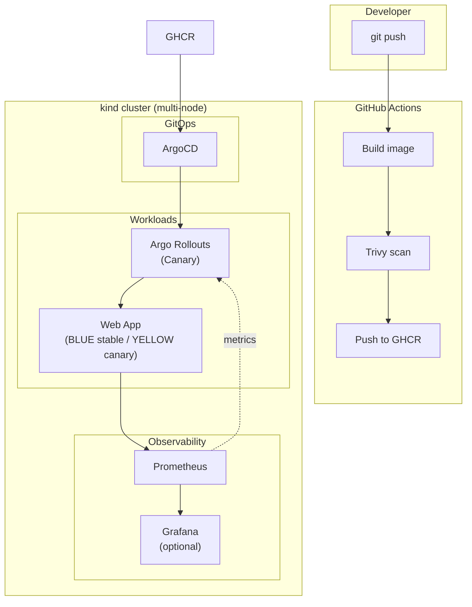
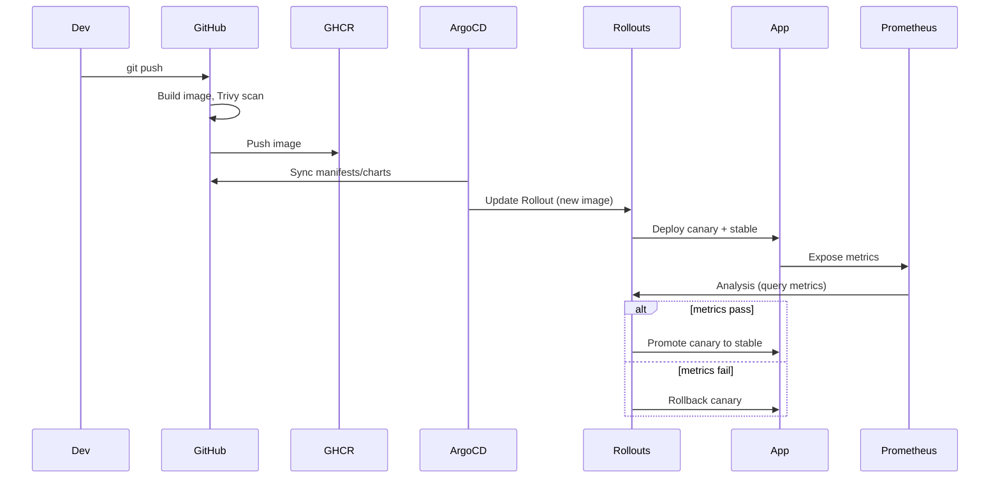

# Project Requirements: LLM K8s Deployment Pipeline

## 1. Project Overview and Problem Statement

**Problem:** A candidate needs to demonstrate Senior DevOps skills (Kubernetes, CI/CD, progressive delivery, observability, GenAI-ready platforms) in a way an interviewer can quickly validate—without relying only on a resume.

**Solution:** A local, production-simulated Kubernetes platform that runs a full Continuous Integration and Progressive Delivery (Canary) pipeline. One push to the repo triggers: container build and Trivy vulnerability scanning (GitHub Actions), image publish to GHCR, and zero-downtime canary deployment (ArgoCD + Argo Rollouts) of a simple web application on a multi-node kind cluster. The deployed app is a **live-demo web app**: the frontend sends requests to the backend; each response identifies whether it was served by the **stable** (e.g. BLUE) or **canary** (e.g. YELLOW) deployment, and the UI shows this as live data with **visual cues** (blue vs yellow). Traffic routing and automatic promote/rollback are driven by Prometheus metrics, with optional Grafana dashboards for visual proof. Supporting documentation (e.g. ARCHITECTURE.md) and a clear “skills demonstrated” mapping make the demo interview-friendly.

---

## 2. Stakeholders and User Personas

| Persona | Who | Needs |
|--------|-----|-------|
| **Primary: Interviewer** | Hiring manager / technical interviewer (e.g. Teradata Senior DevOps) | Validate that the candidate can design, build, and operate Kubernetes-based platforms, CI/CD, and canary deployments—preferably in a visual, runnable way (e.g. live traffic split visible in the app UI). |
| **Secondary: Candidate** | Project owner | A single, reproducible demo and docs to present during the interview and share via GitHub. |

---

## 3. Functional Requirements

- **CI (GitHub Actions)**  
  - On push (or tag), build application container image.  
  - Run Trivy vulnerability scanning on the image; pipeline can fail or warn on findings (policy TBD).  
  - Push image to GitHub Container Registry (GHCR).

- **Local Kubernetes**  
  - Multi-node kind cluster.  
  - Production-simulated layout (control plane + workers) suitable for demonstrating rollouts and traffic.

- **GitOps and Progressive Delivery**  
  - ArgoCD reconciles application state from repo (manifests/charts).  
  - Argo Rollouts manages canary rollout of the web app (canary steps, traffic split).  
  - Promotion/rollback driven by Prometheus metrics (e.g. success rate, latency) via AnalysisTemplates.

- **Application (live-demo web app)**  
  - **Backend:** HTTP service that identifies itself by deployment (e.g. stable = BLUE, canary = YELLOW). Each response indicates which variant served the request. Exposes Prometheus metrics (request count, latency, success) for canary analysis.  
  - **Frontend:** Simple web UI that **sends requests automatically at 10 per second** to the backend and displays **live data** about which backend served each response, with **visual cues** (e.g. blue for stable, yellow for canary). The per-request view is a **flowing bubble stream**: dots/bubbles in a bounded area that flow across the screen (new ones appear, older ones drift out) rather than a single static line—so an interviewer sees live traffic and the canary split in real time. A **summary bar + counts** (BLUE vs YELLOW totals and %) remain the main readout.

- **Observability**  
  - Prometheus scrapes app and/or ingress metrics.  
  - Optional: one Grafana dashboard with 1–2 charts (e.g. canary vs stable traffic or success rate) so metrics-driven canary is visually obvious.

- **Documentation and Interview Readiness**  
  - `ARCHITECTURE.md` in the repo (e.g. under `docs/` or root) with high-level design and a Mermaid diagram, visible on GitHub.  
  - README with how to run the cluster, run the pipeline, and observe canary (app UI blue/yellow cues, Argo Rollouts UI, optional Grafana).  
  - Optional: “Skills demonstrated” section mapping job requirements (K8s, Docker, Helm, CI/CD, canary, observability) to parts of this project.

---

## 4. Non-Functional Requirements

- **Reproducibility:** One-command (or minimal steps) bring-up of kind cluster and baseline deployment so an interviewer can run it locally if desired.
- **Security:** No secrets in repo; use GitHub Actions secrets or similar for GHCR and any tokens.
- **Performance:** Not critical; focus on correctness and clarity of pipeline and canary behavior.
- **Reliability:** Pipeline and rollouts should complete deterministically for the demo (no flaky steps).

---

## 5. Constraints, Dependencies, and Risks

| Item | Notes |
|------|------|
| **Registry** | GitHub Container Registry (GHCR). |
| **Scanning** | Trivy in GitHub Actions. |
| **Cluster** | kind, multi-node, local. |
| **Timeline** | ASAP. |
| **Risks** | Argo Rollouts + Prometheus analysis can be finicky (metric names, timing); mitigate with a simple, well-documented AnalysisTemplate and a backend that reliably exposes metrics. |
| **Dependencies** | Docker, kind, kubectl, GitHub repo with Actions enabled, GHCR permissions for the repo. |

---

## 6. Success Metrics and Acceptance Criteria

**Definition of done (success):**

- One push to the repo triggers:  
  **build → Trivy scan → push to GHCR → ArgoCD sync → canary rollout** with **automatic promotion when Prometheus metrics pass** (or **rollback when they fail**), visible in Argo Rollouts (and optionally in one Grafana dashboard).

**Acceptance criteria:**

1. GitHub Action builds container image and runs Trivy; image is pushed to GHCR.
2. Multi-node kind cluster can be created and ArgoCD + Argo Rollouts installed.
3. Web app (backend + frontend) is deployed via Argo Rollouts canary; canary and stable receive traffic according to rollout steps; UI shows live request data with BLUE (stable) / YELLOW (canary) visual cues.
4. Prometheus scrapes metrics used by Rollout AnalysisTemplate; successful analysis promotes canary; failed analysis triggers rollback.
5. `ARCHITECTURE.md` exists in the repo with at least one Mermaid diagram and is linked from README.
6. README explains how to run the pipeline and observe the canary (and optional Grafana).

---

## 7. Phased Implementation Plan

### Phase 1: Foundation

- Define repo layout (e.g. `apps/`, `charts/`, `.github/workflows/`, `docs/`).
- Create multi-node kind cluster config and bootstrap script.
- Document ARCHITECTURE (high-level design + data flow) in `docs/ARCHITECTURE.md` (or root `ARCHITECTURE.md`) with Mermaid diagrams; link from README.
- **Web app UI:** Develop the demo frontend: flowing bubble stream in a bounded area (new bubbles appear, older ones drift out), summary bar + counts (BLUE vs YELLOW totals and %), automatic 10 requests per second. Include a minimal backend or stub that returns which variant (BLUE/YELLOW) served each request so the UI can be built and tested locally; full backend (Prometheus metrics, deployment identity) and K8s deployment remain in Phase 2.
- Optional: add README “Skills demonstrated” section mapping to job requirements.

### Phase 2: Core Build

- **CI:** GitHub Actions workflow: build image, run Trivy, push to GHCR (use repo secrets for auth).
- **App:** Backend HTTP service that identifies as BLUE (stable) or YELLOW (canary), exposes Prometheus metrics; frontend web UI that sends requests and shows live data with blue/yellow visual cues for which backend responded.
- **K8s:** Helm chart (or plain manifests) for the app; integrate with Argo Rollouts (Rollout, AnalysisTemplate, Service/Ingress or traffic manager).
- **GitOps:** ArgoCD Application(s) pointing at this repo; Rollout uses image from GHCR.
- **Observability:** Prometheus installed and configured to scrape the app (and any ingress); AnalysisTemplate uses Prometheus provider.
- **Canary:** Rollout canary steps and analysis so that promote/rollback happen automatically based on metrics.

### Phase 3: Validation and Launch

- End-to-end test: push change → pipeline runs → canary deploys → metrics-based promote (and optionally test rollback by breaking metric).
- Optional: one Grafana dashboard (1–2 panels) showing canary vs stable (e.g. request rate or success rate).
- README updated with runbook: create kind cluster, install ArgoCD/Rollouts/Prometheus, run pipeline, observe in Argo Rollouts (and Grafana).
- Final check: ARCHITECTURE.md and README visible and accurate on GitHub.

---

## 8. High-Level Design (Mermaid)

---

## 9. Data Flow (Mermaid)

---

## 10. References

- **Stakeholder goal:** Validate Senior DevOps skills (Kubernetes, Docker, Helm, CI/CD, canary, observability) for a role such as Teradata Senior DevOps Engineer. **App:** Simple web app with live request data; BLUE = stable, YELLOW = canary (visual cues in UI).
- **Registry:** GHCR. **Scanning:** Trivy in GitHub Actions. **Success:** One push → build → scan → deploy canary → auto promote/rollback on metrics, visible in Argo Rollouts (and optional Grafana). **Timeline:** ASAP.
